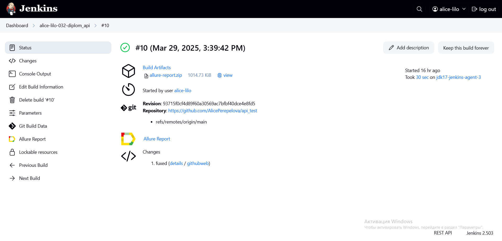
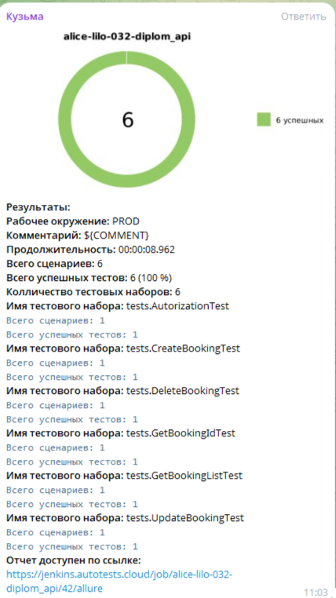

<h1 >Проект по автоматизации тестирования API для сайта 
<a href="https://restful-booker.herokuapp.com/">restful-booker</a></h1>


## :page_with_curl: Содержание

* <a href="#tools">Технологии и инструменты</a>

* <a href="#cases">Реализованные проверки</a>

* <a href="#console">Запуск тестов из терминала</a>

* <a href="#jenkins">Запуск тестов в Jenkins</a>

* <a href="#allure">Allure Report отчеты</a>

* <a href="#allure"> Интеграция с Allure TestOps</a>

* <a href="#jira"> Интеграция с Jira</a>

* <a href="#telegram">Уведомления в Telegram</a>


<a id="tools"></a>
## Технологии и инструменты

| Java                                                                                                    | IntelliJ Idea                                                                                                                | Allure                                                                                                                    | Allure TestOps                                                                                                      | GitHub                                                                                                    | JUnit 5                                                                                                           | Gradle                                                                                                   | REST Assured                                                                                                   |  Jenkins                                                                                                           | Jira                                                                                                                         |
|:--------------------------------------------------------------------------------------------------------|------------------------------------------------------------------------------------------------------------------------------|---------------------------------------------------------------------------------------------------------------------------|---------------------------------------------------------------------------------------------------------------------|-----------------------------------------------------------------------------------------------------------|-------------------------------------------------------------------------------------------------------------------|----------------------------------------------------------------------------------------------------------|----------------------------------------------------------------------------------------------------------------|-------------------------------------------------------------------------------------------------------------------:|------------------------------------------------------------------------------------------------------------------------------|
| <a href="https://www.java.com/"></a> | <a id ="tech" href="https://www.jetbrains.com/idea/"></a> | <a href="https://github.com/allure-framework"></a> | <a href="https://qameta.io/"></a> | <a href="https://github.com/"></a> | <a href="https://junit.org/junit5/"></a> | <a href="https://gradle.org/"></a> | <a href="https://rest-assured.io/"></a>  |   <a href="https://www.jenkins.io/"></a> | <a href="https://www.atlassian.com/ru/software/jira"></a> |


<a id="cases"></a>
## :heavy_check_mark: Реализованные проверки

-  Успешная авторизация пользователя
-  Создание записи о бронировании
-  Удаление записи о бронировании
-  Получение списка бронирования
-  Поиск бронирования по ID
-  Обновление информации о бронировании


<a id="console"></a>
##  Запуск тестов из терминала
### Локальный запуск тестов

```
gradle clean test  
```

<a id="jenkins"></a>
## </a> Запуск тестов в [Jenkins](https://jenkins.autotests.cloud/job/alice-lilo-032-diplom_api/)

<p align="center">

> Для запуска необходимо нажать "Собрать сейчас".

<a href="https://jenkins.autotests.cloud/job/alice-lilo-032-diplom_api/"></a>

> При клике на сборку после завершения можно увидеть артефакты запуска и полезные ссылки для более детального изучения прогона.

<a href="https://jenkins.autotests.cloud/job/alice-lilo-032-diplom_api/"></a>
</p>

<a id="allure"></a>
## </a> [Allure Report](https://jenkins.autotests.cloud/job/alice-lilo-032-diplom_api/10/allure/) отчеты

### Основное окно

<p align="center">

</p>

### Отчеты по тестам

<p align="center">

> В отчете по тестам присутствует развернутая информация по запросам и ответам.


</p>

<a id="allure"></a>
##  </a> Интеграция с <a target="_blank" href="https://allure.autotests.cloud/project/4693/dashboards"> Allure TestOps </a>
На *Dashboard* в <code>Allure TestOps</code> видна статистика количества тестов. Новые тесты, а так же результаты прогона приходят по интеграции при каждом запуске сборки.
<p align="center">

</p>

____
<a id="jira"></a>
##  </a> Интеграция с <a target="_blank" href="https://jira.autotests.cloud/browse/HOMEWORK-1432"> Jira </a>
Реализована интеграция <code>Allure TestOps</code> с <code>Jira</code>, в задаче отображается, какие тест-кейсы были написаны в рамках задачи и результат их прогона.
<p align="center">

</p>

<p >


<a id="telegram"></a>
##  </a> Уведомления в Telegram
> С помощью настроенного бота после завершения прогона в Jenkins поступают уведомления в Telegram.


</p>
